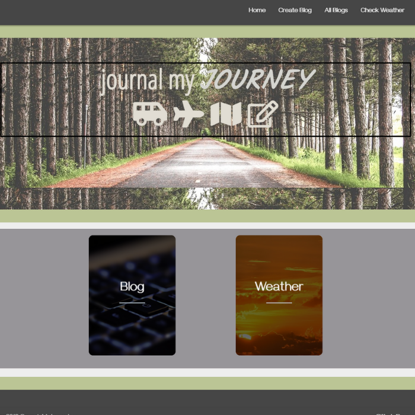

# "Journal My Journey": A full-stack CRUD web application

## Overview

• Link to deployed version: https://journalmyjourney.herokuapp.com/index.html

• Link to Github repository: https://github.com/jenivy06/journal-my-journey

"Journal My Journey" is a full-stack relational database application that features create, read, update and delete (CRUD) functions. The website is geared toward travelers who want to document their journey by posting blogs within a content management system. Blog form input gets saved to a MySQL database. Users are also able to edit or delete their blog posts through put, post, get and delete methods.

Users are also able to access current weather conditions for specifified cities through an API call. Weather data is dynamically populated to the site's user interface from weatherstack, a realt-time REST API. 

## Technology Used: 

*HTML5 
*CSS3 
*Javascript 
*jQuery 
*Node.js 
*Sequelize 
*MySQL 
*Express 
*weatherstack API 
*Materialize CSS Framework 
